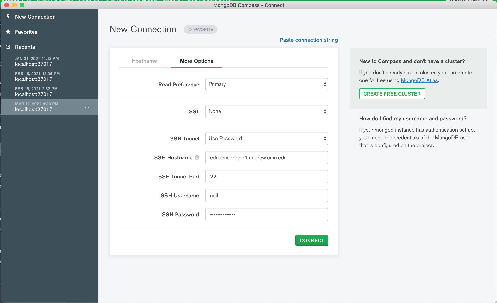

## SSH Tunnel

To build and deploy the app on CMU servers, we use an SSH tunnel.

### MongoDB Compass

It's recommended you download [MongoDB Compass](https://www.mongodb.com/products/compass) instead of navigating MongoDB via the Terminal. You can configure your tunnel by doing the following:



After connecting, you should see a list of databases, which hold collections (called tables in relational databases).

### Tunnel config

Tunnel configuration in the code is handled in `.tunnel-config`. This file should look like this:

```
module.exports = {
    "username": "loginusername",
    "keyPath": "/home/classinsight/.ssh/id_rsa",
    "password": "loginpassword",
    "dbHost": "edusense-dev-1.andrew.cmu.edu"
}
```

This file is imported into `ssh-tunnel.js`.
